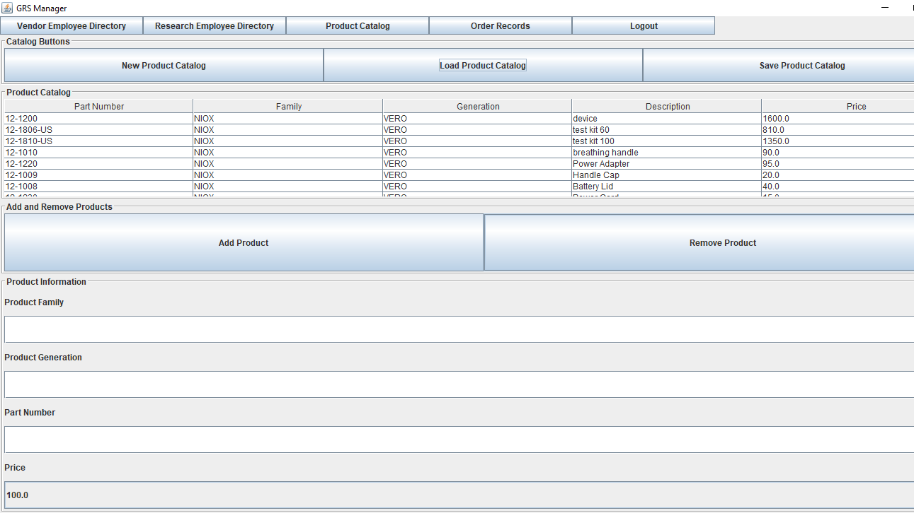
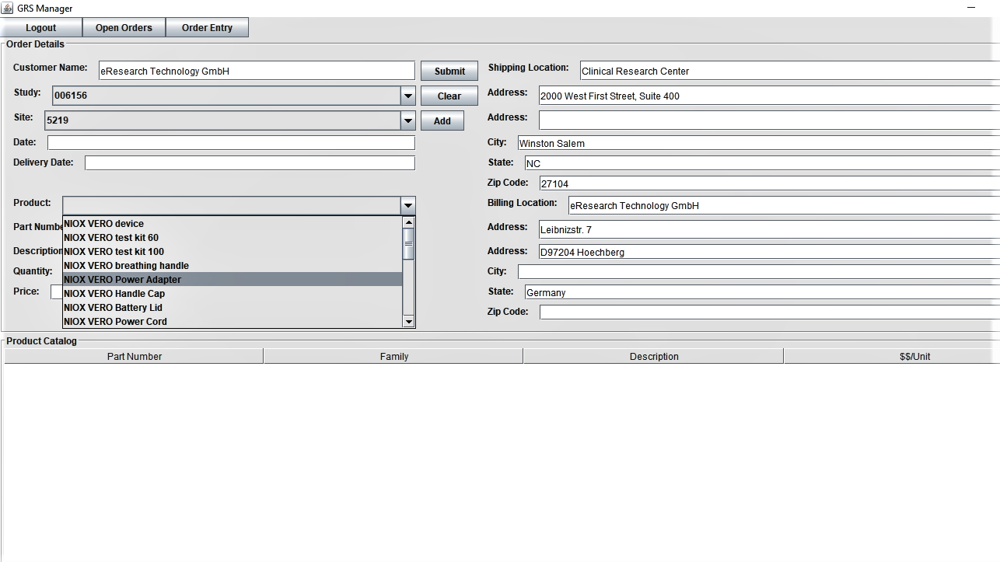

# GRS Manager
[Contract research organizations (CRO)](https://en.wikipedia.org/wiki/Contract_research_organization) provide a variety of clinical research services to pharmaceutical companies. CROs give healthcare companies the option of outsourcing the staff and functions required to conduct research on their product. 

GRSManager is an order entry and tracking program that automates the work-flow associated with a CRO placing orders for a vendor's products. Since CROs frequently manage multiple clinical trials, each with several associated research sites, the program organizes this information into a data model that allows the CRO's user to order products for specific studies and locations. Multiple user authentication into the program enables a vendor's users to then login, process, and modify the status of a particular order. A third type of user, the system administrator, must first load product and order history data so it is available for CRO users placing orders. 

## Getting Started

#### Eclipse in Windows

###### Download GRSManager or clone the repo to your local machine. Import GRSManager into your workbench:
1. Click the File menu and select *import*
2. Select the *File System* folder and click next 
3. Browse file system to select the local repo and select finish

###### Running the program
1. Open source file tree and find/select the com.circa.mrv.grs_manager.ui package.
2. R-click GRSManagerGUI.java and select *Run as Java program*
3. The following login screen should be displayed

## Using GRSManager

### Setting up the System
1. Login as an administrator and add users for a vendor and a research company.
 - Enter the following credentials in the login screen: Login = administrator / Password = admin
 - The administrator can setup and remove users from the system. After login, the vendor employee directory will display. Enter the user information, including first/last name, username, password, and company details. If the email address is blank or the text entered is not a valid email address, a pop-up dialog will appear prompting the user to enter an apropriate address.
 - Click the Research Company button and enter the corresponding information for a system user from the research company. In the combo box select whether this location is a ship-to or bill-to location. 

2. Load the product catalog by clicking the *Load Product Catalog* button and select "products.txt" from the file chooser. After you've loaded the products they should populate the JTable at the top of the panel.

3. Click the *Order Records* button at the top right of the panel and then click *Load Order Records*. Select "unformatted_titles" and click *select*. The file chooser will close and then immediately reopen. Now select "records_text.txt" and click *select*. The table will populate with order history. 

The system now has order records with data on research studies and locations, contact names and info, purchase order numbers, delivery dates, etc. Click the logout button to return to the login screen.

##### Entering Orders
1. Enter the login credentials previously setup by the administrator and select *ok*. Once logged in, select a study from the combo box labeled *study*. The site combo box updates to display only the research sites associated with this study. Select a site and the text fields for shipping location, street address, city, state, and zip code pull in address information for this research site.

2. There are two ways to search products. Select either the combo box labeled *Product* or the one labeled *Part Number*. If you select by product, the part-number combo box will update to display the corresponding part-number. The text field labeled *Price* will also pull in the list price for this item.
 

3. Enter a quantity in the text field labeled *Quantity* and click the *Add* button. The table below will now display the number of products requested and combo boxes and quantity text field will reset.

4. When the order is complete, click the complete button. 

##### Check Order Status
1. A vendor employee logs into the system using the credentials previously setup by the administrator. The table displays orders where the current status =  "OPEN".
2. To change an order's status, select an order from the table and click one of the following buttons *PROCESSED*, *SHIPPED*, *IN PROCESS*.

## Design

GRSManager implements an MVC design. A single instance of the controlling class, Manager.java, receives and processes all GUI requests by calling the appropriate functions from classes in the data model.  Manager's instance variables include data model classes that control order and product information. It converts user interaction with the GUI into functions that add and update objects (e.g. Product, Order, etc.) to the data structures that contain them. This fulfills a basic design principle by separating the *concerns* of data logic and presentation. 

### GUI Classes

###### GRSManager GUI
When the GRSManager GUI is constructed it inits LoginPanel, AdministrationPanel, VendorPanel, and ResearchPanel instance variables and displays the LoginPanel. Both the User Directory, Company Directory, and current user instance variables are empty and so the system will only recognize administrator login credentials. The controlling class contains a static instance variable of itself which can be called with the static getInstance() method. If there is a manager it is returned, null if not.

###### GRSManager
The controlling class which maintains the following data structures for orders, products, and users.

 - ProductCatalog
 - CompanyDirectory
 - OrderRecord
 - Administrator
 - UserDirectory  

GUI components can access these via the single instance of the controlling class. This design is known as the singleton pattern.

###### AdministrationPanel
The AdministrationPanel has four GUI panels for an research employee directory, vendor employee directory, product catalog, and a company assignment panel. The vendor employee directory panel is shown when AdministratorPanel is constructed.

 - AdministratorPanel
 |
 ------VendorEmployeeDirectoryPanel
 |
 ------ResearchEmployeeDirectoryPanel
 |
 ------ProductCatalogPanel
 |
 ------OrderRecordPanel
 |

###### VendorEmployeeDirectoryPanel
The VendorEmployeeDirectoryPanel has two instance variables for user directory and company directory. When it is constructed these are set to the values currently held by GRSManager. if this is the first time an administrator has logged in, both values will be empty. A user can load a new employee directory or add individual users.

###### ProductCatalogPanel
Contains an instance of ProductCatalog which is set to the controlling classes instance. A JTable class is nested into the ProductCatalogPanel and its updateData() method requests a 2D array from the ProductCatalog instance.

##### OrderRecordPanel

## Development & Technology
GRSManager is developed using JRE 1.8.0 in Eclipse.

### Todos

 - VendorCustomerOrderSchedulePanel
 - ResearchCompanyOrderEntryPanel
 - Complete JUnit tests